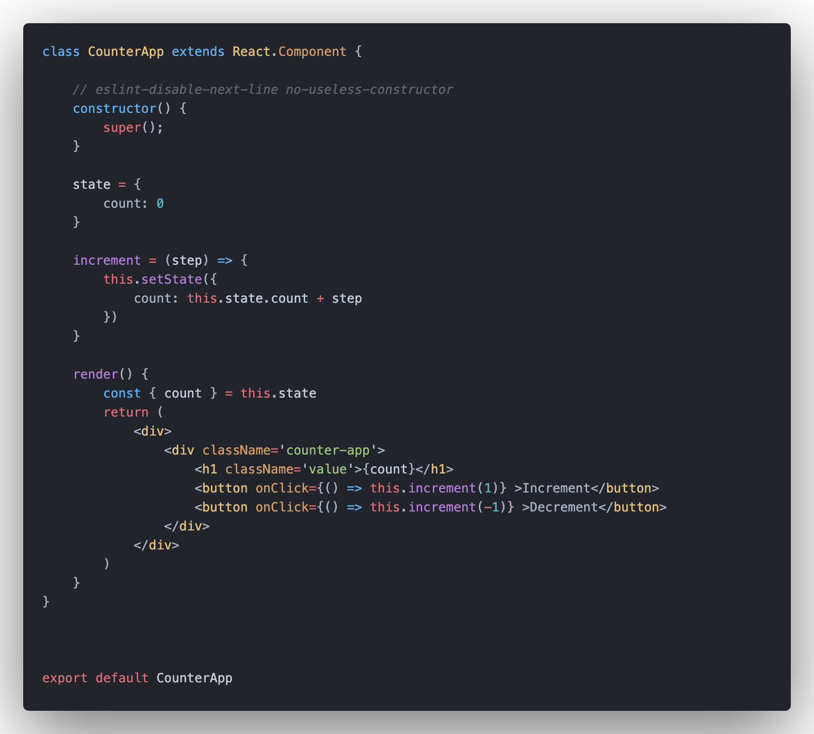

<h1 align="center">
  Sunday fun with React
</h1>

## Project Specifications

- components
- props
- hooks
- state handling
- callback hooks

## TODO LIST
### sleep - eat - code -repeat
 - [X] create counter skeleton

### concept of state in a functional component
<h2 align="center">
  
</h2>

### concept of class component
<h2 align="center">
  
</h2>
